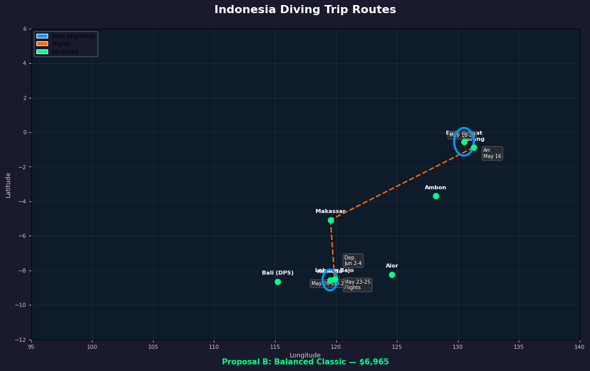
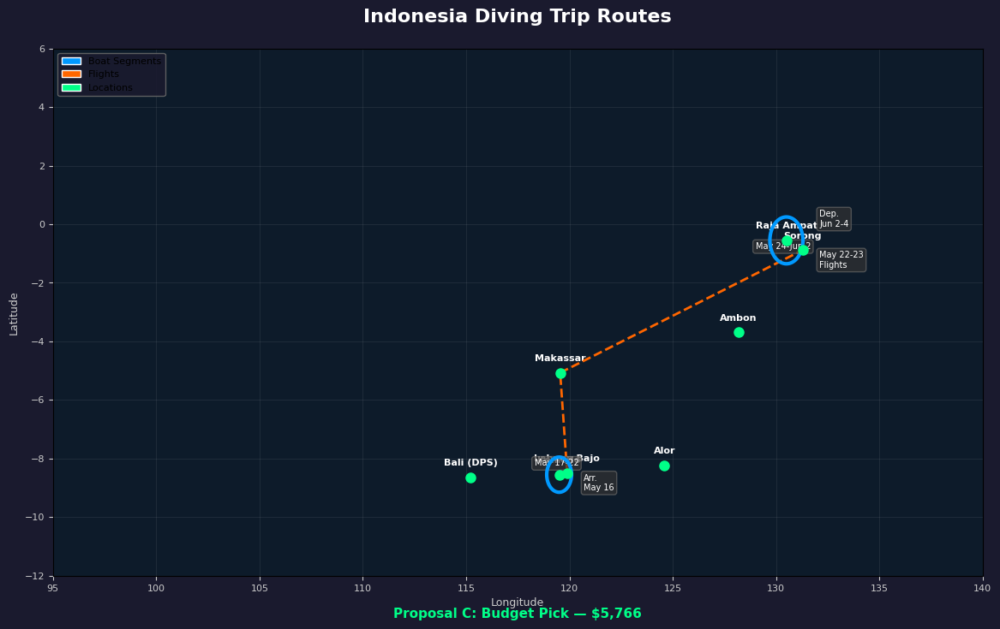

# Indonesia 2026 — Trip Proposals

**Window:** May 16 (arrive) – June 4 (depart) · 20 days
**Requirements:** Komodo ✓ · Raja Ampat ✓ · Maximize boat time · Multi-locale preference

---

## At a Glance

| | Proposal A | Proposal B | Proposal C |
|---|---|---|---|
| **Tag** | Best Value | Balanced Classic | Budget Pick |
| **Boat nights** | 14 (5 + 9) | 14 (7 + 7) | 14 (5 + 9) |
| **Dead days** | 2 | 2 | 1 |
| **Liveaboard cost** | $6,039 | $6,965 | $5,766 |
| **Komodo boat** | Komodo Sea Dragon | Tiare Cruise | Eliya |
| **Raja boat** | Emperor Harmoni | Pearl of Papua | Emperor Harmoni |
| **Direction** | Komodo → Raja | Raja → Komodo | Komodo → Raja |
| **Depart from** | Sorong (SOQ) | Labuan Bajo (LBJ) | Sorong (SOQ) |
| **Raja coverage** | Wide (9N, "Best of RA") | Standard (7N) | Wide (9N, "Best of RA") |
| **Discount** | Emperor Harmoni −30% | — | Emperor Harmoni −30%, Eliya budget-tier |

---

## Proposal A: Best Value

**Total: 14 boat nights · 2 transit days · $6,039 liveaboard**

| Day | Date | Activity | Location |
|-----|------|----------|----------|
| 1 | Fri May 16 | Arrive Labuan Bajo (fly from Bali) | LBJ |
| 2–6 | May 16–21 | **Komodo Sea Dragon** — Komodo N+S (5N) | LBJ → LBJ |
| 7 | May 21 | Disembark. Fly LBJ → Makassar (UPG) | Transit |
| 8 | May 22 | Fly Makassar → Sorong. Rest day. | SOQ |
| — | May 23 | Buffer day in Sorong (or arrive this day) | SOQ |
| 9–17 | May 24–Jun 2 | **Emperor Harmoni** — Best of Raja Ampat (9N) | SOQ → SOQ |
| 18 | Jun 2 | Disembark 9am. Evening in Sorong | SOQ |
| 19–20 | Jun 3–4 | Fly home from Sorong | SOQ → home |

### Leg 1 — Komodo Sea Dragon

| Detail | Info |
|--------|------|
| Dates | May 16 – May 21 (6D/5N) |
| Route | Labuan Bajo → Komodo N+S → Labuan Bajo |
| Cost | **$2,268** |
| Nitrox | Yes (included) |
| Dives | ~18–20 (3–4/day) |
| Sites | Batu Bolong, Castle Rock, Manta Point, Crystal Rock, The Cauldron, Pink Beach |
| Link | [liveaboard.com](https://www.liveaboard.com/diving/indonesia/komodo-sea-dragon) |

Short but punchy. Five nights covers the essential north and south Komodo sites. You'll hit the manta cleaning stations and the famous pinnacles without paying for a week-long Komodo-only trip.

### Leg 2 — Emperor Harmoni

| Detail | Info |
|--------|------|
| Dates | May 24 – Jun 2 (10D/9N) |
| Route | Sorong → Best of Raja Ampat → Sorong |
| Cost | **$3,771** (30% discount!) |
| Nitrox | Yes (free) |
| Dives | ~27–32 (3–4/day) |
| Itinerary | Wide coverage: Dampier Strait, Mansuar, Wayag, Penemu, Fam Islands, Misool potential |
| Link | [liveaboard.com](https://www.liveaboard.com/diving/indonesia/emperor-harmoni) |

This is the star of Proposal A. Nine nights at a 30% discount on a well-rated boat gives you the widest Raja Ampat coverage in the window. The "Best of Raja Ampat" itinerary typically covers both the northern (Wayag, Mansuar) and central regions, which is exactly what you wanted — a broader exploration rather than a narrow circuit.

### Why this works
- **Cheapest total** at $6,039 in liveaboard fees
- Emperor Harmoni's 9-night itinerary is the longest Raja option that fits the window — more coverage than any 7-night alternative
- The 30% discount on Harmoni is unusually good
- 2 transit days (May 21–23) is reasonable for the LBJ→SOQ hop via Makassar
- Ends in Sorong — fly home via Jakarta or Bali

### Risk
- May 23 buffer depends on flight availability (Makassar connections). Book early — May 28 is Eid al-Adha and domestic flights get busy.

---

## Proposal B: Balanced Classic

**Total: 14 boat nights · 2 land nights in LBJ · $6,965 liveaboard**

| Day | Date | Activity | Location |
|-----|------|----------|----------|
| 1 | Fri May 16 | Arrive Sorong | SOQ |
| 2–8 | May 16–23 | **Pearl of Papua** — Raja Ampat (7N) | SOQ → SOQ |
| 9 | May 23 | Disembark. Fly SOQ → Makassar | Transit |
| 10 | May 24 | Fly Makassar → LBJ. Explore Labuan Bajo | LBJ |
| 11 | May 25 | Free day in Labuan Bajo | LBJ |
| 12–18 | May 26–Jun 2 | **Tiare Cruise** — Komodo (7N) | LBJ → LBJ |
| 19 | Jun 2 | Disembark 9am. Evening in LBJ | LBJ |
| 20 | Jun 3–4 | Fly home from Labuan Bajo | LBJ → home |

### Leg 1 — Pearl of Papua

| Detail | Info |
|--------|------|
| Dates | May 16 – May 23 (8D/7N) |
| Route | Sorong → Raja Ampat → Sorong |
| Cost | **$2,730** |
| Nitrox | Yes |
| Dives | ~21–24 (3–4/day) |
| Link | [liveaboard.com](https://www.liveaboard.com/diving/indonesia/pearl-of-papua) |

Budget-friendly Raja Ampat. Seven nights gets you the main Dampier Strait sites, Mansuar, and the iconic cleaning stations. Less extensive than the 9-night Harmoni itinerary, but still solid Raja diving.

### Leg 2 — Tiare Cruise

| Detail | Info |
|--------|------|
| Dates | May 26 12pm – Jun 2 9am (8D/7N) |
| Route | Labuan Bajo → Komodo → Labuan Bajo |
| Cost | **$4,235** |
| Nitrox | Yes |
| Dives | ~24–28 (3–4/day) |
| Link | [liveaboard.com](https://www.liveaboard.com/diving/indonesia/tiare-cruise) |

Full 7-night Komodo circuit — north and south routes with multiple Manta Point visits. More thorough Komodo coverage than the shorter Sea Dragon option in Proposal A.

### Why this works
- **Most balanced** — even 7+7 split means neither locale feels rushed
- Two bonus nights in Labuan Bajo (May 24–25) — explore the town, hit a day dive if you want, or just rest between legs
- **Depart from LBJ** — much easier international connections than Sorong (multiple daily flights to Bali)
- Logistically the cleanest: no tight transfer, good buffer days

### Risk
- Pearl of Papua's 7-night Raja itinerary is narrower in scope than Harmoni's 9-night. You get the highlights but may miss the farther-flung sites (Wayag, Misool).
- ~$900 more than Proposal A for the same boat nights.

---

## Proposal C: Budget Pick

**Total: 14 boat nights · 1 transit day · $5,766 liveaboard**

| Day | Date | Activity | Location |
|-----|------|----------|----------|
| 1 | Fri May 16 | Arrive Labuan Bajo | LBJ |
| 2–6 | May 17–22 | **Eliya** — Northern & Central Komodo (5N) | LBJ → LBJ |
| 7 | May 22 | Disembark. Fly LBJ → Makassar → Sorong | Transit |
| 8 | May 23 | Arrive Sorong. Rest day | SOQ |
| 9–17 | May 24–Jun 2 | **Emperor Harmoni** — Best of Raja Ampat (9N) | SOQ → SOQ |
| 18 | Jun 2 | Disembark 9am | SOQ |
| 19–20 | Jun 3–4 | Fly home from Sorong | SOQ → home |

### Leg 1 — Eliya

| Detail | Info |
|--------|------|
| Dates | May 17 – May 22 (6D/5N) |
| Route | Labuan Bajo → Northern & Central Komodo → Labuan Bajo |
| Cost | **$1,995** |
| Nitrox | Check with operator |
| Spaces | ⚠️ Only 2 spaces left |
| Link | [liveaboard.com](https://www.liveaboard.com/diving/indonesia/eliya) |

The budget Komodo option. $1,995 for 5 nights is hard to beat. Covers north and central Komodo sites. The catch: only 2 spaces remain, so this needs to be booked fast if you want to bring buddies.

### Leg 2 — Emperor Harmoni (same as Proposal A)

| Detail | Info |
|--------|------|
| Dates | May 24 – Jun 2 (10D/9N) |
| Cost | **$3,771** (30% discount) |
| Nitrox | Yes (free) |

Same outstanding 9-night Raja leg as Proposal A.

### Why this works
- **Cheapest total** at $5,766 — saves ~$1,200 vs Proposal B
- Same wide Raja coverage as Proposal A
- Tightest itinerary: only 1 dedicated transit day (May 22), with May 23 as buffer
- Eliya starts May 17 (not May 16), giving you a rest day after arriving in LBJ

### Risk
- Eliya has only 2 spaces — won't work if you're bringing 2–4 buddies
- Budget boat = potentially less polished experience
- No nitrox confirmation — check before booking

---

## Boats That Almost Worked

These didn't make the final proposals but are worth knowing about:

| Boat | Dates | Route | Cost | Why it didn't fit |
|------|-------|-------|------|-------------------|
| Raja Ampat Aggressor | May 16–26 (10N) | SOQ→SOQ | $5,049 | Best Raja boat, but no Komodo liveaboard starts May 28+ that ends by Jun 4 |
| Blue Manta | May 18–28 (10N) | LBJ→Alor | $4,860 | Komodo + Alor in one boat (dream multi-locale leg), but Alor→Sorong transit kills any Raja pairing |
| Ilike | May 19–30 (11N) | Ambon→Alor | $4,253 | Banda Sea + Alor crossing — amazing, but no time for both Komodo AND this |
| Dancing Wind | May 18–25 (7N) | SOQ→SOQ | $3,675 | SOQ→LBJ transfer in <28hrs for Tiare Cruise is too risky |
| Naga Biru | May 16–27 (11N) | Bali→LBJ | $4,302 | Epic Bali→Komodo crossing, but ends May 27 with no Raja boat to catch |
| ScubaSpa Zen | May 30–Jun 6 (7N) | LBJ→LBJ | $4,950 | Ends Jun 6 — 2 days past your departure |
| Mari | May 27–Jun 6 (10N) | SOQ→SOQ | $4,124 | Ends Jun 6 — 2 days past your departure |
| Gaia Love | May 24–Jun 2 | Bau Bau→Bau Bau | $5,760 | **SOLD OUT** |

---

## Flight Logistics

### LBJ → SOQ (for Proposals A & C)
No direct flights. Two common routing options:

1. **Via Makassar (UPG):** LBJ → UPG (~2hrs) → UPG → SOQ (~3.5hrs). Total: ~8–10hrs including layover. Airlines: Wings Air, Batik Air, Garuda.
2. **Via Bali (DPS):** LBJ → DPS (~1.5hrs) → DPS → SOQ (~4hrs). Slightly longer but more flight options.

### SOQ → LBJ (for Proposal B)
Same routes in reverse: SOQ → UPG → LBJ or SOQ → DPS → LBJ.

### ⚠️ Eid al-Adha — May 28, 2026
Domestic flights surge around this date. Book internal flights early, especially the SOQ↔LBJ legs. Consider booking refundable tickets now even before confirming liveaboards.

### Estimated flight costs (one-way, domestic)
- Bali → LBJ: $60–150
- LBJ → SOQ (via UPG): $150–300
- SOQ → LBJ (via UPG): $150–300
- SOQ → Bali/Jakarta (homeward): $150–350

---

## Budget Summary

| Item | Proposal A | Proposal B | Proposal C |
|------|-----------|-----------|-----------|
| Liveaboard total | $6,039 | $6,965 | $5,766 |
| Domestic flights (est.) | $350–500 | $350–500 | $350–500 |
| Hotels (transit nights) | $60–160 | $60–160 | $30–80 |
| Komodo NP fee | ~$25 | ~$25 | ~$25 |
| Raja Ampat marine park fee | ~$100 | ~$100 | ~$100 |
| Nitrox surcharges | Included | ~$50–100 | ~$50–100 |
| **Estimated total** | **$6,600–6,850** | **$7,500–7,750** | **$6,300–6,500** |

*Excludes: international flights, gear shipping, visa (IDR 500k / ~$35), travel insurance, tips*

---

## My Recommendation

**Proposal A (Best Value)** is the strongest overall. You get the widest Raja Ampat coverage at the best price, and the shorter Komodo leg still hits every major site. The Emperor Harmoni 30% discount is too good to pass up for a 9-night "Best of Raja Ampat" itinerary.

If you'd rather end in LBJ for easier flights home, **Proposal B** is the way to go — the even 7+7 split and 2 nights in Labuan Bajo make it the most relaxed option.

**Proposal C** only makes sense if budget is the primary concern and you're traveling solo or with 1 buddy (Eliya has just 2 spaces).

### Next steps
1. Check Emperor Harmoni availability (it's discounted 30% — that fills fast)
2. Book domestic flights early (Eid al-Adha May 28 = surge)
3. Confirm nitrox availability on Eliya if going with Proposal C
4. I've already drafted inquiry emails to the Komodo operators — want me to do the same for the Raja Ampat boats?
