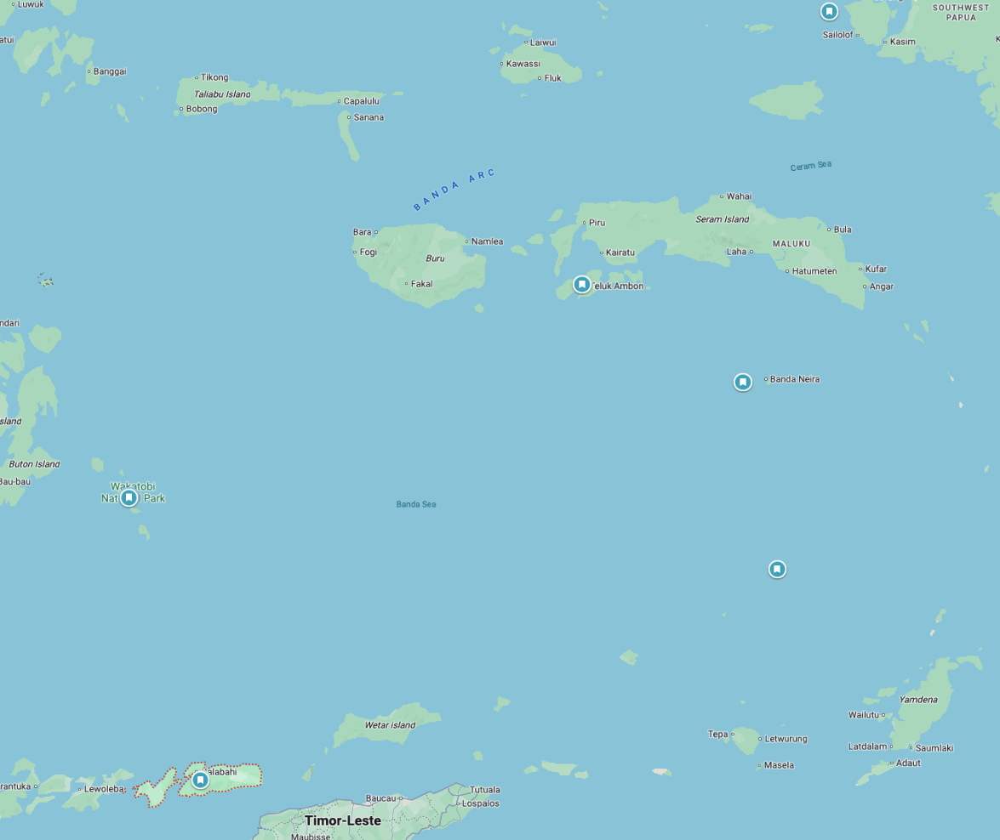

# Banda Sea / Banda Islands

## Overview
Remote, pristine, and steeped in history — the original Spice Islands. The Banda Sea offers dramatic underwater topography along the Ring of Fire, big pelagic encounters, and healthy reef systems rarely touched by other divers. Access is liveaboard-only for most sites. Timing is critical: May is excellent, but June brings monsoon conditions that shut diving down.

## Dates
- **Window:** Must be completed by end of May — June is monsoon season with rough seas and poor vis
- **Season:** May = excellent (end of Apr–May inter-monsoon window). June = off-season. Do NOT plan Banda Sea in June.
- **Weather:** May is favorable — calm seas, stable conditions. June flips to rough monsoon.

## Diving

### Conditions
| Factor | Details |
|--------|---------|
| Visibility | 20–30m (up to 40m on good days) |
| Water temp | 25–28°C (77–82°F) |
| Currents | Strong — experienced divers only |
| Wetsuit | 3–5mm depending on thermocline exposure |

### Seasonal Events (May–June)
- Pelagics active: tuna, barracuda, reef sharks, eagle rays
- Hammerhead sharks are the famous draw, but peak is Oct–Nov (outside this window)
- Hawksbill and green turtles year-round
- Pristine soft corals and sea fans on volcanic walls

### Key Dive Sites
| Site | Depth | Highlights | Difficulty |
|------|-------|------------|------------|
| Serua Island (Jackpot) | 10–40m+ | Drift dives, dramatic drop-offs, eagle rays, black corals | Advanced |
| Palau Run (Run Island) | 10–30m | Schools of fish, pelagics (tuna, barracuda), turtles | Moderate–Advanced |
| Banda Neira | 5–25m | Volcanic walls, sea fans, macro life | Moderate |
| Hatta Island | 10–30m | Pristine coral gardens, reef sharks | Moderate |
| Ai Island | 5–20m | Wall diving, soft coral, turtles | Moderate |

### Operators
Access is **liveaboard only** for most Banda Sea sites. Book early — trips are limited and sell out months ahead.

| Operator | Type | Email | Nitrox | Notes |
|----------|------|-------|--------|-------|
| [Dewi Nusantara](https://dewi-nusantara.com) | Luxury liveaboard | via dewi-nusantara.com | Yes | Premier Indonesian liveaboard, Banda Sea routes Apr–May |
| [Damai](https://dive-damai.com) | Luxury liveaboard | dfriedrich@gmail.com | Yes | Charter inquiries, high-end operation |
| [Aggressor Fleet](https://aggressor.com) | Liveaboard | info@aggressor.com | Yes | Established fleet, multiple Indonesia routes |
| [Master Liveaboards (Indo Master)](https://masterliveaboards.com) | Premium liveaboard | dive@masterliveaboards.com | Yes | 47m vessel built 2022, photo-friendly |
| [Mermaid Liveaboards](https://mermaid-liveaboards.com) | Liveaboard | info@mermaid-liveaboards.com | Yes | Stable steel vessels, multi-destination routes |
| [Wallacea Dive Cruise](https://wallacea-divecruise.com) | Liveaboard | info@wallacea-divecruise.com | Yes | Operating since 2002, Banda Sea specialist |
| [Solitude Adventurer](https://solitude-liveaboards.com) | Liveaboard | emailus@solitude-liveaboards.com | Yes | Growing reputation, professional operation |

### Dive Plan
- 9–10 night expedition typical
- 3–4 dives/day across remote volcanic islands
- Nitrox essential for repetitive deep drift dives
- Priority: Serua, Run, Hatta for pelagic action

## Logistics

### Getting There
- Fly to **Ambon (Pattimura Airport)** — the main embarkation point for Banda Sea liveaboards
- Route from Bali: DPS → Makassar (UPG) or Manado (MDC) → Ambon
- Airlines: Lion Air, Garuda Indonesia, Sriwijaya Air
- **Arrive a day before embarkation** — domestic flights to Ambon are delay-prone

### Getting Out
- Disembark in Ambon → fly to next destination
- Some liveaboards end in Sorong (connecting to Raja Ampat) — check itinerary

### Accommodation
- Pre/post liveaboard: hotels in Ambon city ($30–80/night)
- Liveaboard cabin included in trip price

### Costs
| Item | Estimate (USD) |
|------|---------------|
| Banda Sea liveaboard (9–10 nights) | $4,000–8,000+ |
| Domestic flights to Ambon | $150–300 |
| Pre-night hotel in Ambon | $30–80 |
| Tips (crew) | $200–400 |

### Practical Info
- **Visa:** Indonesia e-VoA (same as other Indonesian legs)
- **Currency:** IDR. Limited ATMs in Ambon — bring cash.
- **Connectivity:** Minimal to none on liveaboard. Ambon city has 4G.
- **Hyperbaric chamber:** Ambon has a naval hospital with a chamber. Nearest reliable alternatives in Makassar or Manado.

## Notes
- **Timing is everything** — May works, June does not. If Banda Sea is on the table, it must be early in the trip.
- This is one of the most remote diving experiences in Indonesia
- Book 6–12 months ahead for May departures
- Hammerhead season (Oct–Nov) would be a reason to return separately
- Some liveaboards combine Banda Sea + Raja Ampat or Banda Sea + Alor in one routing
