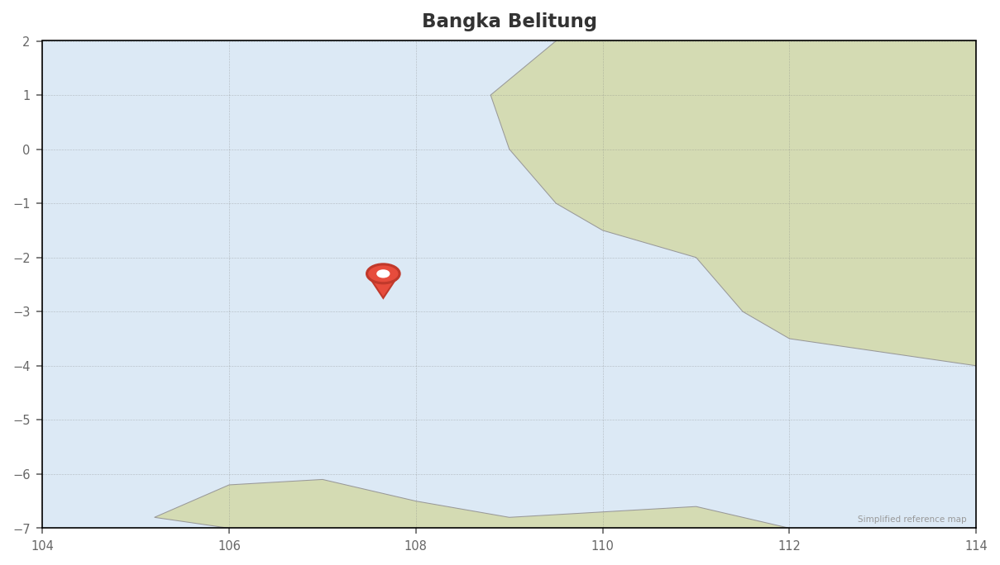

# Bangka Belitung Islands (Belitung)

## Overview
Underwater granite wonderland. Massive granite boulders extend from land into the sea, creating maze-like formations draped in coral. UNESCO Geopark status recognizes the geological significance, and the diving is as unique as the landscape. Crystal-clear water, pristine reefs, and almost no crowds. This is geology meets marine biology.

## Dates
- **Window:** May 15–June 5 is PEAK / OPTIMAL — best visibility, calm seas, sunny weather
- **Season:** Peak dry season (March–June). July–September brings strong currents and degraded visibility.
- **Weather:** Calm, sunny, ideal. May–June is the best diving window of the year.

## Diving

### Conditions
| Factor | Details |
|--------|---------|
| Visibility | Up to 35m (May–June peak) |
| Water temp | 26–28°C (can drop to 25°C in June) |
| Currents | Calm in May–June. Strong currents/surge only July–September. |
| Wetsuit | 3mm |

### Seasonal Events (May–June)
- No major pelagic events — the draw is the unique underwater topography
- Vibrant coral activity during dry season
- Blue-spotted stingrays active around granite formations
- Reef fish populations at their most colorful

### Key Dive Sites
| Site | Depth | Highlights | Difficulty |
|------|-------|------------|------------|
| Batu Berlayar ("Sailing Rock") | 5–25m | Dramatic granite formations above/below water, narrow swim-throughs, coral-covered walls | Moderate |
| Cepor Cepor ("Rocks") | 5–20m | Sheltered channel between granite islands, blue-spotted stingrays, butterflyfish, groupers | Easy–Moderate |
| Granite Pinnacles (multiple sites) | 10–30m | Massive pinnacles, sandy channels, caves, steep rock faces, coral carpeting | Moderate |
| Kepayang Island area | 5–25m | Mixed granite/coral sites, diverse reef fish | Moderate |

### Operators
**Note:** Belitung Island has limited dive infrastructure. Most diving in this region occurs at Bangka Island (North Sulawesi), which is a different location. For Belitung Island specifically:

| Operator | Type | Email | Nitrox | Notes |
|----------|------|-------|--------|-------|
| [Rock & Wreck Dive Resort](https://rockandwreckresort.com) | Land-based resort | info@rockandwreckresort.com | Yes | Primary Belitung dive resort. Beachfront, daily dive boats, 25+ sites within 30 min. |

**For more developed diving, consider Bangka Island (North Sulawesi):**
- [Nomad Divers Bangka](https://nomaddiversbangka.com) (info@nomaddiversbangka.com)
- [Murex Resorts Bangka](https://murexresorts.com) ([email protected])
- [Bastianos Bangka](https://bastianos.com) (via bastianos.com)

### Dive Plan
- 5–7 days, land-based resort
- 2–3 dives/day = 10–20 dives total
- Focus on granite formation sites (Batu Berlayar, Cepor Cepor)
- Wide-angle lens essential for capturing formations
- Macro lens useful for coral detail and critters in granite crevices
- Nitrox useful but not critical (moderate depths)

## Logistics

### Getting There
- Fly to **Tanjung Pandan (H.A.S. Hanandjoeddin Airport, TJQ)** on Belitung Island
- Route from Bali: DPS → TJQ, ~2 hrs, multiple daily flights
- Airlines: Garuda Indonesia, Lion Air, Nam Air
- Route from Jakarta: CGK → TJQ, ~45 min, 7+ daily flights

### Getting Out
- Fly TJQ → Bali or Jakarta for onward connections
- Very accessible — one of the easier remote dive destinations

### Accommodation
- **Rock & Wreck Dive Resort:** Starting from $70/night, beachfront, white sand beach, full board available
- Budget guesthouses in Tanjung Pandan: $30–60/night (for pre/post nights)
- Resorts book via direct email or OTAs (Agoda, Booking.com, Traveloka)

### Costs
| Item | Estimate (USD) |
|------|---------------|
| Diving (10 dives over 5 days) | $400–800 |
| Accommodation (7 nights, resort) | $500–1,000 |
| Domestic flight Bali → Belitung | $150–400 |
| Meals (if not full board) | $150–300 |
| Transfers & activities | $100–200 |

### Practical Info
- **Visa:** Indonesia e-VoA, IDR 500,000 (~$30)
- **Currency:** IDR. Moderate ATM availability in Tanjung Pandan — bring backup cash for resort payments.
- **Connectivity:** Moderate 4G in main areas. Resort has WiFi (check quality directly).
- **Hyperbaric chamber:** **No chamber on Belitung or nearby.** Nearest reliable facilities are Medan or Singapore (requires evacuation). DAN insurance essential. Verify emergency protocols with Rock & Wreck before booking.

## Notes
- The underwater granite formations are genuinely unique — you won't see this anywhere else in Indonesia
- UNESCO Geopark status means the landscape (above and below water) is internationally recognized
- Much more affordable than Komodo, Raja Ampat, or Halmahera liveaboards
- **Geography clarification:** This is Belitung Island in Bangka Belitung Province (off Sumatra). NOT Bangka Island in North Sulawesi. Use "Belitung" in bookings to avoid confusion.
- Ideal for divers who want unique topography over pelagic action
- Great for underwater photographers — crystal-clear water + unusual formations = distinctive images
- Pairs well with a Komodo or Halmahera trip if you want contrast (pelagics vs. geology)
- Best combined with Bali recovery days — easy flight connections make this less grueling than remote destinations
