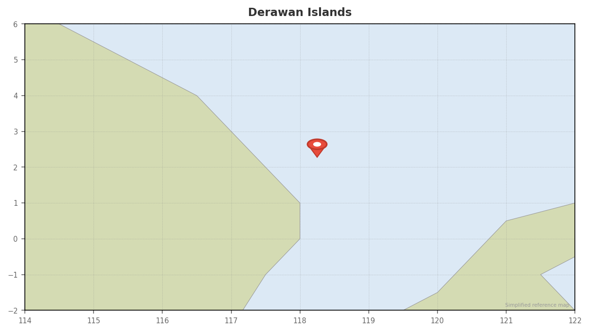

# Derawan Islands

## Overview
An archipelago off East Kalimantan (Borneo) with a rare combination of attractions: daily manta encounters at Sangalaki, a jellyfish lake at Kakaban (similar to Palau's), big pelagics at Maratua atoll, and nesting sea turtles. Less visited than Komodo or Raja Ampat, Derawan offers a unique Borneo-side Indonesian diving experience.

## Dates
- **Window:** Flexible — dry season (Jun–Aug) is peak, May is the transition
- **Season:** Shoulder (May) moving into peak (June). Whale sharks present mid-May through mid-September. Good timing overall.
- **Weather:** Minimal monsoon impact (near equator). May–Jun is dry and stable.

## Diving

### Conditions
| Factor | Details |
|--------|---------|
| Visibility | 10–30m (highly variable by site) |
| Water temp | 27–28°C (81–82°F) |
| Currents | Variable — strong at Kakaban, manta-feeding currents at Sangalaki |
| Wetsuit | 3mm or rashguard |

### Seasonal Events (May–June)
- **Whale sharks:** Arrive mid-May, present through mid-September
- **Manta rays:** Year-round at Sangalaki — feeding and cleaning stations active
- **Turtle nesting:** Green turtles nest on Sangalaki and Derawan beaches year-round
- **Jellyfish lake:** Non-stinging jellyfish at Kakaban — accessible year-round

### Key Dive Sites
| Site | Depth | Highlights | Difficulty |
|------|-------|------------|------------|
| Sangalaki — Manta Point | 5–20m | Near-daily manta encounters, cleaning stations | Moderate |
| Kakaban — Jellyfish Lake | Surface | Snorkel/swim with non-stinging jellyfish (4 species) | Easy (snorkel) |
| Kakaban — Outer Wall | 10–40m | Sharp drop-offs, leopard sharks, grey reef sharks, hammerheads | Advanced |
| Maratua Atoll — Channel | 10–35m | Big pelagics — grey sharks, tuna, eagle rays, barracuda, trevally | Advanced |
| Derawan Island | 5–20m | Muck diving, turtles, macro, schooling fish | Easy–Moderate |

### Operators
| Operator | Type | Email | Nitrox | Notes |
|----------|------|-------|--------|-------|
| [Derawan Dive Lodge (Tasik Divers)](https://derawandivelodge.com) | Land-based resort | info@derawandivelodge.com | Yes | PADI 5★, full-service resort with transfers and tours |
| [ScubaJunkie Sangalaki](https://scubajunkiesangalaki.com) | Land-based resort | [email protected] | Yes | PADI 5★, manta diving focus, Sangalaki Island based |
| Nabucco Island Resort | Resort | via booking sites | TBC | Maratua atoll location, full facilities |

### Dive Plan
- 5–7 days covering all major sites
- Day trips to Sangalaki (mantas), Kakaban (jellyfish lake + walls), Maratua (pelagics)
- 2–3 dives/day + snorkel sessions at jellyfish lake
- Nitrox useful for Maratua and Kakaban wall dives

## Logistics

### Getting There
- Fly to **Balikpapan (BPN)** — the international airport in East Kalimantan
- Domestic flight Balikpapan → **Berau (BEJ)** — ~45 min
- From Berau: shared taxi to Tanjung Batu harbor, then boat to Derawan (~1–2 hrs)
- Total travel: ~6–8 hrs from Bali with connections

### Getting Out
- Reverse route: boat → Berau → Balikpapan → Bali or onward

### Accommodation
- **Derawan Dive Lodge:** Full resort, diving packages
- **Homestays on Derawan Island:** $17–20/night (basic, with AC)
- **Maratua resorts:** Nabuko Resort, Paradise Resort (higher-end)
- **Sangalaki:** ScubaJunkie has accommodation on the island

### Costs
| Item | Estimate (USD) |
|------|---------------|
| Diving (5–7 days) | $300–700 |
| Accommodation (7 nights) | $120–1,000+ (homestay to resort) |
| Flights Bali → Balikpapan → Berau | $180–350 |
| Boat transfers to islands | $20–50 |
| Jellyfish lake fee | ~$10 |
| Island-hopping boat charters | $100/day |

### Practical Info
- **Visa:** Indonesia e-VoA
- **Currency:** IDR. **No ATMs on the islands.** Bring cash from Berau or Balikpapan.
- **Connectivity:** Minimal on islands. Berau has 4G.
- **Hyperbaric chamber:** None on the islands. Nearest in Balikpapan (mainland) — requires boat + flight evacuation. DAN insurance essential.

## Notes
- Kakaban's jellyfish lake is one of only a few on the planet — special experience even for non-divers
- Sangalaki mantas are very reliable — one of the best manta sites in Indonesia outside Komodo/Nusa Penida
- Less tourist infrastructure than more popular destinations — that's part of the charm
- Combines well with a Borneo stopover (orangutan trekking in Tanjung Puting is accessible from Balikpapan)
- Whale shark season starting mid-May is a bonus for this window
