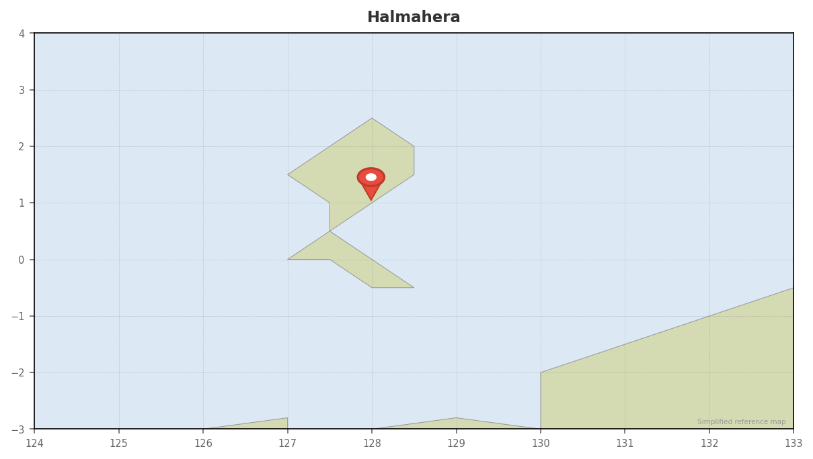

# Halmahera

## Overview
The "next Raja Ampat" — genuinely remote, genuinely pristine. Halmahera sits between North Sulawesi and West Papua in the heart of the Coral Triangle, with 450+ coral species and minimal tourism impact. Pelagics patrol nutrient-rich channels, macro life thrives on black sand slopes, and you'll likely be the only divers on most sites. This is exploration diving at its purest.

## Dates
- **Window:** May 15–31 optimal. Avoid June 1–15 (transitional monsoon). June 16–Sep 15: no diving (strong winds).
- **Season:** Shoulder (May is end of Mar–May peak). June brings unpredictable conditions as winds pick up.
- **Weather:** May has calm seas and excellent conditions. June 1+ transitions to rougher weather.

## Diving

### Conditions
| Factor | Details |
|--------|---------|
| Visibility | 10–40m (typically 30m+ in May) |
| Water temp | 28–29°C (81–84°F) |
| Currents | Moderate to strong — nutrient upwellings feed the reefs |
| Thermoclines | Minimal |
| Wetsuit | 3mm |
| Experience | Advanced OW minimum for current-swept sites |

### Seasonal Events (May–June)
- **Hammerhead sharks:** March–November season (active in May)
- **Manta rays and mobula rays:** Frequently seen at cleaning stations
- **Pelagics active:** Tuna, barracuda schools, large reef sharks patrolling channels
- **Halmahera Epaulette Shark:** Unique species, common on night dives
- **Macro life:** Mandarinfish at dusk, frogfish, ghost pipefish, nudibranchs

### Key Dive Sites
| Site | Depth | Highlights | Difficulty |
|------|-------|------------|------------|
| Pulau Tifore | 10–30m | Iconic drift dive, barracuda schools, big-eye trevally, mandarinfish at dusk | Advanced |
| Patinti Strait | 10–45m+ | Channels between Bacan and Halmahera, reef sharks, tuna, macro heaven | Advanced |
| Bacan Island (black sand slopes) | 5–25m | Muck diving — frogfish, ghost pipefish, cuttlefish, nudibranchs | Moderate |
| Goraici Islands | 5–40m | 40+ dive sites, coral walls, sheltered bays, varied ecosystem | Moderate–Advanced |
| Weda Bay Region | 10–35m | Pristine hard and soft corals, minimal bleaching, strong currents | Moderate–Advanced |

### Operators
**Liveaboard access recommended** — land-based resort permanently closed.

| Operator | Type | Email | Nitrox | Notes |
|----------|------|-------|--------|-------|
| [Wallacea Dive Cruise](https://wallacea-divecruise.com) | Liveaboard (Ambai, Seahorse) | info@wallacea-divecruise.com | Yes | Operating since 2002, Tifore/Ternate/Bacan routes |
| [Mermaid Liveaboards](https://mermaid-liveaboards.com) | Liveaboard (Mermaid I, II) | info@mermaid-liveaboards.com | Yes | 10-day Halmahera $3,440/person; 12-day RA–Halmahera–Lembeh $5,365 |
| [Konjo Cruising Indonesia](https://konjocruisingindonesia.com) | Liveaboard (JAKARE) | via konjocruisingindonesia.com | Yes | Halmahera specialist since 2013, private/shared cabins |
| [Damai I & II](https://dive-damai.com) | Luxury liveaboard | via dive-damai.com | Yes | High-end operation, Halmahera routes |
| [Jelajahi Laut (Mikumba)](https://mikumbadiving.com) | Liveaboard | [email protected] | Yes | Eco-conscious operator, WhatsApp 8am-8pm Bali time |

### Dive Plan
- 10-day liveaboard recommended for May window
- 3–4 dives/day = 30–40 dives total
- Mix of drift dives (pelagics), muck dives (macro), and reef exploration
- Nitrox essential for repetitive deep dives
- Priority: Pulau Tifore, Patinti Strait, Bacan black sand

## Logistics

### Getting There
- Fly to **Ternate (Sultan Babullah Airport, TTE)** — the main embarkation point
- Route from Bali: DPS → TTE via TransNusa, Wings Air (~7 hrs including connections)
- Alternative: Some liveaboards depart Sorong (SOQ) and include Halmahera on their routing
- **Arrive a day early** — North Maluku flights can be unreliable

### Getting Out
- Fly Ternate → Bali or Jakarta for onward connections
- Or continue liveaboard to Sorong/Raja Ampat if combined trip

### Accommodation
- **Liveaboard:** cabins included in trip price (recommended option)
- **Pre/post nights in Ternate:** Budget hotels $10–20/night; mid-range $40–60/night
- **Note:** Weda Resort permanently closed (industrial activities ceased eco-tourism operations)

### Costs
| Item | Estimate (USD) |
|------|---------------|
| Halmahera liveaboard (10 nights) | $3,400–5,500 |
| Domestic flights Bali → Ternate | $300–800 |
| Pre-night hotel in Ternate | $10–60 |
| Tips (crew) | $200–300 |

### Practical Info
- **Visa:** Indonesia e-VoA, IDR 500,000 (~$30). Apply at evisa.imigrasi.go.id
- **Currency:** IDR. Limited ATMs in Ternate — bring backup cash.
- **Connectivity:** Adequate 4G in Ternate. Minimal to none on liveaboard or remote Halmahera sites.
- **Hyperbaric chamber:** Nearest reliable facilities in Manado (~100–150 km, 1–2 hr evacuation). Malalayang Hospital (+62 431 8383058), Siloam Hospital (+62 431 7290900).

## Notes
- This is Raja Ampat-level biodiversity without the crowds or the price tag
- Timing is critical — May 15–31 is the sweet spot. After that, conditions degrade quickly.
- Genuinely remote — you're exploring sites that see maybe a handful of divers per year
- If pelagics and pristine reefs are the goal, this is a bucket-list destination
- Book liveaboard 6–12 months ahead — limited operators run Halmahera routes
- Comparison to Raja Ampat: Halmahera has 450+ coral species vs. RA's 550+, but reef health is arguably better due to minimal tourism impact
