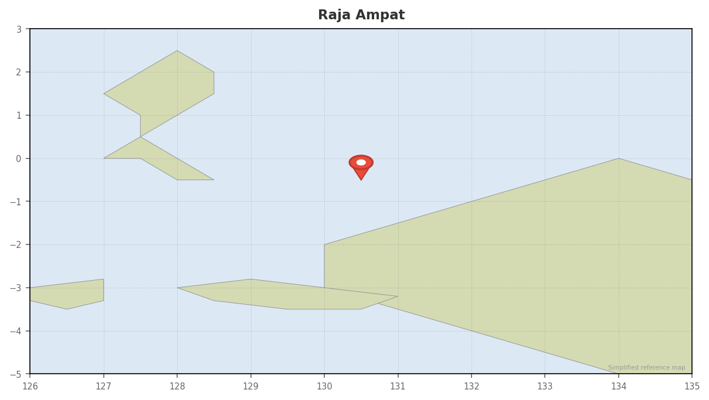

# Raja Ampat

## Overview
Arguably the most biodiverse marine ecosystem on Earth, located in the heart of the Coral Triangle. Raja Ampat is known for pristine reefs, massive fish biomass, manta aggregations, and vibrant soft coral gardens. Diving ranges from gentle reef slopes to strong current channels and pinnacles.

---

## Dates
- **Window:** May 28 – June 7 (per itinerary, Leg 3)
- **Season:** Transition into dry season (excellent conditions)
- **Weather:** Calmer seas than earlier in the year, reduced rainfall, improving visibility

---

## Diving

### Conditions

| Factor | Details |
|--------|---------|
| Visibility | 15–30m (can vary with plankton) |
| Water temp | 27–29°C (80–84°F) |
| Currents | Moderate to strong in channels and passes |
| Thermoclines | Rare but possible in deeper channels |
| Wetsuit | 3mm full suit sufficient |

---

### Seasonal Events (May–June)

- Manta ray feeding and cleaning station activity (especially Dampier Strait & Misool)
- Reef fish spawning aggregations (groupers, snappers)
- Peak coral health and fish biomass following April coral spawning
- Occasional oceanic manta sightings offshore
- High probability of reef shark encounters on current-swept sites

---

### Key Regions & Dive Sites

#### Dampier Strait (Central Raja)

| Site | Depth | Highlights | Difficulty |
|------|-------|------------|------------|
| Cape Kri | 5–40m | Record fish biodiversity, massive schools, reef sharks | Advanced |
| Blue Magic | 5–30m | Oceanic manta potential, trevally, barracuda | Advanced |
| Sardine Reef | 5–30m | Dense fish clouds, reef sharks | Moderate |
| Mioskon | 5–20m | Turtles, wobbegong sharks, relaxed reef | Easy–Moderate |

#### Misool (South Raja)

| Site | Depth | Highlights | Difficulty |
|------|-------|------------|------------|
| Magic Mountain | 5–30m | Reef + oceanic mantas, schooling fish | Advanced |
| Boo Windows | 5–25m | Iconic swim-throughs, soft coral gardens | Moderate |
| Fiabacet | 5–30m | Explosive fish biomass, reef sharks | Moderate–Advanced |
| Nudi Rock | 5–25m | Macro + schooling fish combo | Moderate |

---

## Operators

| Operator | Type | Email | Nitrox | Notes |
|----------|------|-------|--------|-------|
| [Papua Explorers](https://papuaexplorers.com) | Resort + Day Boats | info@papuaexplorers.com | Yes | Strong marine biology focus, house reef access, Dampier Strait base |
| [Meridian Adventure Dive](https://raja.meridianadventuredive.com) | Resort | info@meridianadventure.com | Yes | Camera facilities, good for photographers |
| [Raja Ampat Dive Lodge](https://rajaampatdivelodge.com) | Resort | reservations@rajaampatdivelodge.com | Yes | Comfortable land-based option, central location |
| [Soul Scuba Divers](https://soulscuba.com) | Land-based | reservations@soulscuba.com | Yes | Small groups, conservation-minded |
| [Misool Eco Resort](https://misool.info) | Resort | reservations@misoolecoresort.com | Yes | Premium eco-resort in south Raja, pristine reefs, conservation-focused |
| [Aggressor Adventures (Raja Ampat Aggressor)](https://aggressor.com) | Liveaboard | rajaampat@aggressor.com | Yes | International fleet standards, predictable operations |
| [Mermaid Liveaboards](https://mermaid-liveaboards.com) | Liveaboard | info@mermaid-liveaboards.com | Yes | Stable steel vessels, good for photographers |
| [Indo Siren (Master Liveaboards)](https://masterliveaboards.com) | Liveaboard | info@masterliveaboards.com | Yes | Mid–premium tier, longer itineraries |
| [Coralia Liveaboard](https://coralia-liveaboard.com) | Liveaboard | info@coralia-liveaboard.com | Yes | Boutique phinisi, small groups |
| [Amira Liveaboard](https://amira-indonesia.com) | Liveaboard | info@amiraboard.com | Yes | Long-standing Indonesia specialist |
| [Damai Liveaboards](https://dive-damai.com) | Luxury Liveaboard | info@damaii.com | Yes | High-end luxury, very spacious dive deck |

---

## Dive Plan

- 7–10 night liveaboard recommended to cover north + south regions
- 3–4 dives per day, ~24–30 dives total
- Nitrox strongly recommended
- Priority: Cape Kri, Blue Magic, Magic Mountain, Boo Windows

---

## Logistics

### Getting There

- International flight → Jakarta (CGK) or Bali (DPS)
- Domestic flight to **Sorong (SOQ)**
- Operators typically provide airport pickup
- Most liveaboards depart Sorong harbor

### Getting Out

- Fly Sorong → Jakarta or Bali for international connection
- Allow buffer day for domestic flight variability

---

## Accommodation (Land-Based Option)

| Type | Price Range (USD/night) |
|------|--------------------------|
| Homestay | $35–60 |
| Mid-range Dive Resort | $150–300 |
| Premium Eco Resort | $500–1,200 |

---

## Costs

| Item | Estimate (USD) |
|------|---------------|
| 7–10 night liveaboard | $2,500–6,000 |
| Domestic flight to Sorong | $150–350 |
| Raja Ampat marine park fee | ~$100 (valid for 1 year) |
| Nitrox surcharge | $5–15/tank |
| Homestay daily dive package | ~$120–180/day |

---

## Practical Info

- **Visa:** Indonesia e-VoA (~$35)
- **Currency:** IDR; limited ATMs in Sorong
- **Connectivity:** Limited outside Sorong; assume no reliable data at sea
- **Hyperbaric chamber:** Sorong has basic chamber; Bali is nearest full facility
- **SMB required** for current diving
- Surface marker and reef hook commonly used

---

## Notes

- May–June offers ideal balance of visibility and plankton (good manta odds)
- North (Dampier Strait) = fish density + currents
- South (Misool) = pristine reefs + manta hotspots
- Liveaboard provides best coverage; land-based works well for Dampier Strait only
- Book well in advance — peak season overlaps with European summer planning
